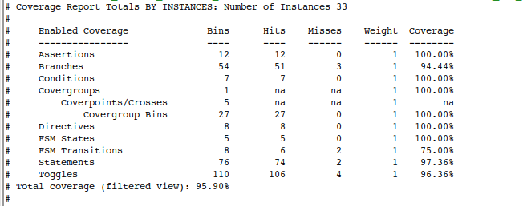
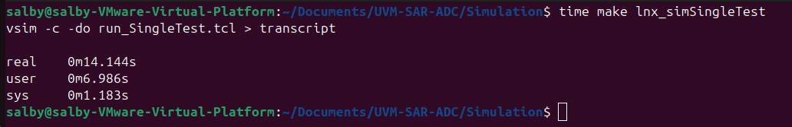
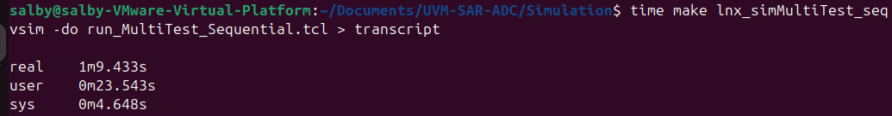
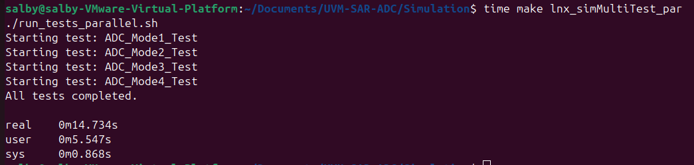

# UVM-SAR-ADC

This repository contains a **Universal Verification Methodology (UVM)** testbench for verifying a **Successive Approximation Register Analog-to-Digital Converter (SAR-ADC)** design. The project showcases a complete functional verification environment using industry-standard UVM practices.

> [!IMPORTANT]
> The RTL design files for the SAR-ADC RTL are sourced externally and are not created by me, done by [UVM AMS TEAM](https://docs.google.com/document/d/1hYTKV5uwAwiOqRAxozzYEXZuelAb0_p5_eVgXfvsk0M/edit?usp=sharing). This repository focuses only on the verification environment using UVM.

## 🧪 Project Description

The goal of this project is to verify a SAR-ADC RTL design using a fully layered UVM testbench. The testbench is structured to enable:

- Stimulus generation and randomized testing
- Transaction-level modeling
- Scoreboarding and coverage collection
- Reusability and scalability for future analog/digital mixed-signal designs

---

## 🧠 Test Strategy

This project supports different modes of running tests:

- **Single Test Run**: Runs one UVM test to verify a specific scenario or feature.
- **Multiple Test Run (Sequential)**: Runs multiple tests one after another. Useful for batch verification and regression.
- **Multiple Test Run (Parallel)**: Runs multiple UVM tests concurrently to speed up simulation time and improve runtime efficiency, especially for long test regressions or large test suites.

<!-- > 💡 **Note:** Running tests in **parallel** significantly enhances simulation performance by reducing the overall execution time compared to running them sequentially. -->

> [!NOTE]
> Running tests in **parallel** significantly enhances simulation performance by reducing the overall execution time compared to running all sequences in single test or running multiple test sequentially.
---

##  UVM hierarchy

```sh
└── UVM-SAR-ADC/
    ├── UVM/
    │   ├── interface
    │   │   └── AES_intf.sv
    │   ├── objects
    │   │   ├── configration
    │   │   │   └── configration.sv
    │   │   ├── sequenceItem
    │   │   │   └── sequenceItem.sv
    │   │   └── sequences
    │   │       ├── main_sequence.sv
    │   │       ├── rst_sequence.sv
    │   │       ├── mode1_sequence.sv
    │   │       ├── mode2_sequence.sv
    │   │       ├── mode3_sequence.sv
    │   │       └── mode4_sequence.sv
    │   ├── shared_pkg
    │   │   └── shared_pkg.sv
    │   └── testbench_top
    │       ├── test
    │       │   ├── env
    │       │   │   ├── env.sv
    │       │   │   ├── agent
    │       │   │   │   ├── agent.sv
    │       │   │   │   ├── monitor
    │       │   │   │   │   └── monitor.sv
    │       │   │   │   ├── driver
    │       │   │   │   │   └── driver.sv
    │       │   │   │   └── sequencer
    │       │   │   │       └── sequencer.sv
    │       │   │   ├── scoreboard
    │       │   │   │   └── scoreboard.sv
    │       │   │   └── subscriber
    │       │   │       └── subscriber.sv
    │       │   └── test.sv
    │       └── top.sv
    ├── SAR_ADC_RTL/
    │   ├── ...
    │   ├── ...
    │   └── ...
    ├── Reports/
    │   └── ...
    ├── Simulation/
    │   ├── Makefile
    │   ├── extracted.py
    │   ├── run_tests_parallel.bat
    │   ├── run_tests_parallel.sh
    │   ├── run_MultiTest_Parallel.tcl
    │   ├── run_MultiTest_Sequential.tcl
    │   ├── run_SingleTest.tcl
    │   └── srcfiles_dms.f
    └── UCDB_files/
        └── ...
```


## 🔧 Prerequisites

To run this project, you will need:

- **SystemVerilog Simulator** (e.g., [QuestaSim](https://eda.sw.siemens.com/en-US/ic/questa/))
- **UVM Library** (usually comes with simulator or install separately)
- A Unix-like environment for using Makefile (Linux, macOS, or WSL on Windows)

---

## ▶️ Running on Windows

### 1. Open Command Prompt (CMD)

### 2. Clone the Repository

    git clone https://github.com/Abdelrahman1810/UVM-SAR-ADC.git
    cd UVM-SAR-ADC

### 3. Run the Simulation
🔹 Single Test

- `Without GUI`

    ```
    make win_simSingleTest
    ```
- `GUI` 

    ```bash
    make win_simCapstats
    ```
    
🔹 Multiple Tests (Sequential)

- `GUI` 

    ```bash
    make win_simMultiTest_seq
    ```
    
🔹 Multiple Tests (Parallel)

- `Without GUI` 

    ```bash
    make win_simMultiTest_par
    ```

---


## 🐧 Running on Linux/macOS

### 1. Open Terminal

### 2. Clone the Repository

    ```
    git clone https://github.com/Abdelrahman1810/UVM-SAR-ADC.git
    cd UVM-SAR-ADC
    ```

### 3. Run the Simulation
🔹 Single Test

- `Without GUI`

    ```
    make lnx_simSingleTest
    ```
- `GUI` 

    ```bash
    make lnx_simCapstats
    ```
    
🔹 Multiple Tests (Sequential)

- `GUI` 

    ```bash
    make lnx_simMultiTest_seq
    ```
    
🔹 Multiple Tests (Parallel)

- `Without GUI` 

    ```bash
    make lnx_simMultiTest_par
    ```

---

## 📊 Coverage & Logs
The UVM-SAR-ADC project incorporates both functional and code coverage metrics to assess the thoroughness of the verification process. Coverage data is generated during simulation and can be analyzed to identify untested scenarios or code segments.

### HTLM Report
.png)
.png)


### Total Coverage: 95.90%

---

## ⏱️ Verification Time Comparison
This section compares the simulation real-time duration for different test execution strategies used in the UVM-SAR-ADC project.

Mode | Description | Real Time | Pros | Cons
| --- | --- | --- | --- | --- |
`Single Test` | All sequences run inside one testbench session | 9.015 seconds | Simple setup  Easier debug | Longer simulation time
`Multiple Tests (Sequential)` | Each test runs independently, one after the other (serial execution) | 28.191 seconds | Modular testing  Isolated logs | Slower overall  No speedup
`Multiple Tests (Parallel)` | Each test runs in a separate simulation instance simultaneously (in parallel) | 6.415 seconds | Fastest overall  Best for coverage regression | Higher resource usage  Complex scripting


- Single Test (Only `user` and `sys` time is considered)



---

- Multiple Test Sequential (Only `user` and `sys` time is considered)



---

- Multiple Test Parallel (Only `user` and `sys` time is considered)


---

### 📌 How to Measure
You can measure simulation real-time by observing terminal output or appending time before the command:
```bash
time make <lnx_sim...>
```
> [!IMPORTANT]
> Before mesure time make sure remove:
> 
> All `#time` from test
>
> All comand exept the `vsim` one (e.g. remove `python3 extract.py`)

---

## 🧑‍💻Contributing
If you find any issues or have suggestions for improvement, feel free to submit a pull request or open an issue in the repository. Contributions are always welcome!

---

## Contact info 💜
<a href="https://linktr.ee/A_Hassanen" target="_blank">
  
</a> 
<br>
<br>
